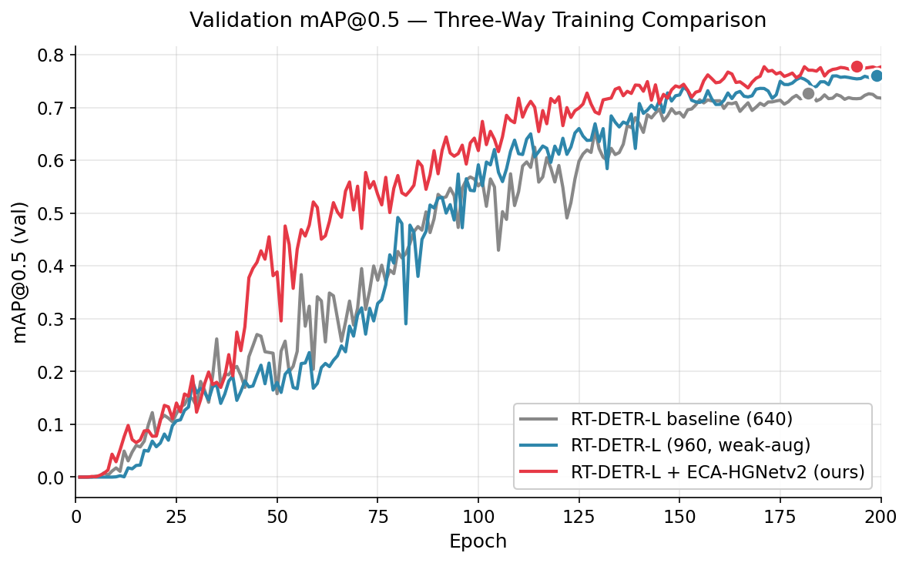
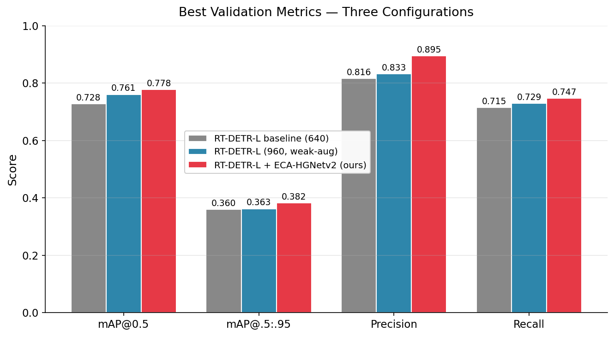

# UAV-Tiny-Object-Detection

> Research on tiny-object detection for UAV aerial imagery,
> featuring **ECA-HGNetv2** backbone enhancement.
>
> Zhejiang Provincial Student Sci-Tech Innovation Program (新苗人才计划) 2025 · Completed final review.

## 🎯 Key Results

| Model | test mAP@0.5 | Best F1 | Params | Notes |
| --- | --- | --- | --- | --- |
| RT-DETR-L baseline (640) | 0.728 | 0.71 | 32.8M | — |
| RT-DETR-L (960, weak-aug) | 0.761* | 0.77 | 32.8M | resolution helps tiny objects |
| **RT-DETR-L + ECA-HGNetv2 (ours)** | **0.782** | **0.78** | 32.8M **+17** | best run (seed 0) |
| YOLO26s baseline | 0.581 | — | 10.0M | — |
| YOLO26s + EMA (ours) | 0.623 | — | 10.1M | lightweight track |

<sub>*validation mAP@0.5; test numbers are reported where evaluated. The ECA result of 0.782 is the best of multiple seeds; see [results/seed_stability.md](results/seed_stability.md) for the full multi-seed analysis.</sub>



## 🔑 Key Finding: Attention Position Matters

The central contribution is not the absolute mAP, but the demonstration
that **the same attention mechanism produces opposite outcomes depending
on insertion position**:

| Architecture | Attention | Position | Δ mAP@0.5 |
| --- | --- | --- | --- |
| YOLO26s | EMA | neck outputs (P3/P4/P5), before Detect | **+4.2 pp** ✅ |
| RT-DETR-L | EMA | after CCFF output | **−29%** ❌ |
| RT-DETR-L | ECA | inside HGNetv2 backbone | **+5.4 pp** ✅ |

→ Attention modules are **not** plug-and-play across architectures.
Full analysis in [results/main_results.md](results/main_results.md).



## 🔍 Highlights

- **+5.4 pp test mAP** via ECA-HGNetv2 (only **+17 learnable parameters**)
- Discovered the **position-dependency of attention modules**
- 20+ controlled experiments across YOLO26s / RT-DETR-L / D-FINE families
- Full record of **negative results** — see [results/negative_results.md](results/negative_results.md)

## 📂 Repository Structure

```
models/           # ECA module & HGBlock_ECA implementation
configs/          # Model architecture configurations
train/            # Training scripts (YOLO26s+EMA, RT-DETR-L+ECA)
data_processing/  # Dataset cleaning, splitting, format conversion
results/          # Experiment logs, figures, ablation & negative results
experiments/      # Failed-experiment code (for reproducibility)
docs/             # Additional documentation
```

## 🚀 Quick Start

```bash
pip install -r requirements.txt

# Train RT-DETR-L + ECA-HGNetv2 (best configuration)
python train/train_rtdetr_eca.py \
    --model configs/rtdetr-l-eca.yaml \
    --data ./data/uav/data.yaml \
    --imgsz 960 --epochs 200 --name eca_main
```

See [train/README.md](train/README.md) for full training instructions and
[data_processing/README.md](data_processing/README.md) for data preparation.

## 📊 Results

Detailed results, ablation studies, multi-seed stability, and negative
findings are documented in [results/](results/).

## 📜 Acknowledgements

- **Base Framework**: [Ultralytics](https://github.com/ultralytics/ultralytics)
- **RT-DETR**: [lyuwenyu/RT-DETR](https://github.com/lyuwenyu/RT-DETR) (CVPR 2024)
- **ECA-Net**: Wang et al., CVPR 2020
- Supported by the Zhejiang Provincial Student Sci-Tech Innovation Program (新苗人才计划).

## 📄 License

Released under the Apache-2.0 License. See [LICENSE](LICENSE) for details.

Note: The dataset is not included due to regulatory considerations
regarding the specific plant species studied.

---

📧 Contact: 15825585898@163.com
🎓 Author: Xiaoyi Zheng (郑潇一), Zhejiang Chinese Medical University
