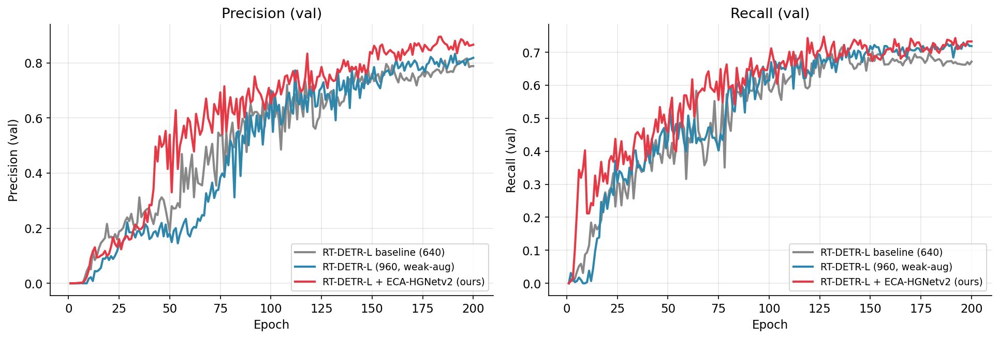
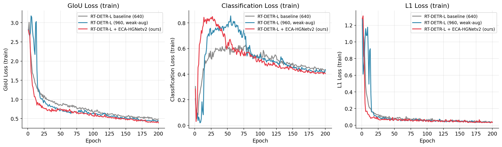

# Experimental Results

This directory contains the full experimental record behind the
**ECA-HGNetv2** improvement: training logs, comparison figures, ablation
studies, multi-seed stability analysis, and — importantly — the negative
results that shaped the final design.

> **Note on metrics.** Figures and CSV logs in this directory report
> **validation-set** metrics logged during training. The headline numbers
> quoted in the main README (test mAP@0.5 = 0.782) refer to the
> **held-out test set** (76 images), evaluated once after training.

---

## 1. Headline Result

| Configuration | val mAP@0.5 | val mAP@.5:.95 | Precision | Recall |
| --- | --- | --- | --- | --- |
| RT-DETR-L baseline (640) | 0.728 | 0.360 | 0.816 | 0.715 |
| RT-DETR-L (960, weak-aug) | 0.761 | 0.363 | 0.833 | 0.729 |
| **RT-DETR-L + ECA-HGNetv2 (ours)** | **0.778** | **0.382** | **0.895** | **0.747** |

The ECA-HGNetv2 modification improves every metric over both the original
baseline and the strengthened 960/weak-aug baseline, while adding only
**17 learnable parameters**.

The ECA-augmented model (red) leads the validation mAP@0.5 curve for the
majority of training and converges to the highest final value.

---

## 2. Final Metrics Comparison

The largest relative gain appears in **Precision** (0.816 → 0.895),
indicating that channel attention in the backbone helps the detector
suppress false positives on cluttered aerial backgrounds — a common
failure mode in tiny-object detection.

---

## 3. Precision & Recall Dynamics

ECA-HGNetv2 reaches a high-precision regime substantially earlier in
training (around epoch 40-50) than either baseline, and maintains the
lead throughout.

---

## 4. Training Losses

GIoU and L1 localization losses converge faster and lower for the
ECA-augmented model, consistent with improved feature selectivity at the
backbone level.

---

## 5. Detailed Documents

| Document | Contents |
| --- | --- |
| [`main_results.md`](main_results.md) | Test-set results, the headline +5.4 pp improvement, and the position-dependency finding |
| [`ablation_full.md`](ablation_full.md) | All controlled experiments across YOLO26s / RT-DETR-L / D-FINE |
| [`negative_results.md`](negative_results.md) | Approaches that were tried and failed, with analysis |
| [`seed_stability.md`](seed_stability.md) | Multi-seed reproducibility of the ECA improvement |

## 6. Raw Logs

- `csv_logs/rtdetr_l_baseline_640.csv` — per-epoch metrics, baseline
- `csv_logs/rtdetr_l_960_weakaug.csv` — per-epoch metrics, 960/weak-aug
- `csv_logs/rtdetr_l_eca_seed0.csv` — per-epoch metrics, ECA-HGNetv2
- `csv_logs/args_*.yaml` — sanitized training configurations

All figures in this directory are regenerated from these CSV logs; you
can reproduce them with the plotting utilities described in the main
README.
